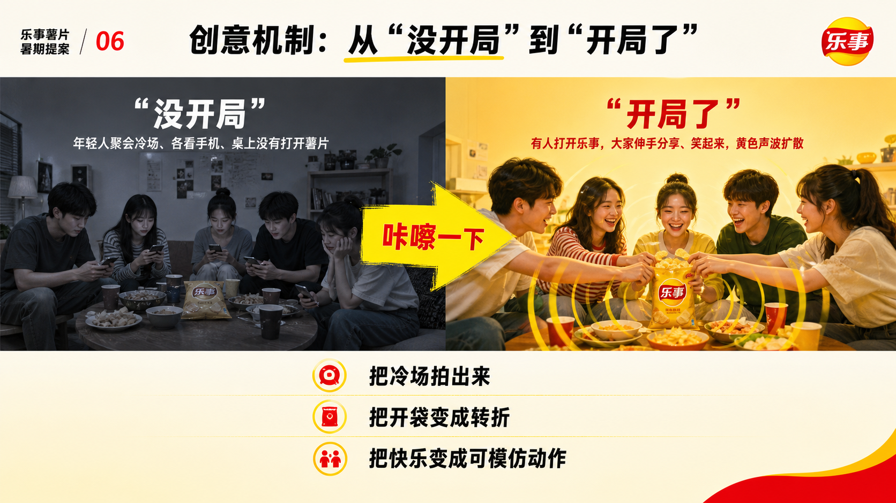
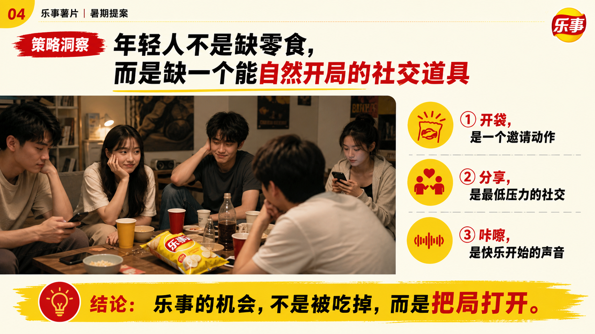

# 广告提案 Agent Skills

**一套面向策略、创意、内容与品牌团队的模块化 Agent Skill 系统：将模糊 Brief 推进为可研究、可判断、可表达、可交付的广告提案。**

[English](README.md) · [工作流](docs/workflow.md) · [示例 Brief](examples/lays-summer-brief.md) · [中文使用说明](https://my.feishu.cn/docx/Q95Sdsj30oEwLOxxpMDci6mKnHd)

Ad Proposal Skills 将高质量广告提案背后的专业推演拆成 7 个可组合 Skill。它不是“一键生成 PPT”的 Prompt，而是一套可追溯的工作方法：从定义问题、建立证据，到形成洞察、推演创意、组织提案叙事、制定视觉系统，再到交付质检与复盘沉淀。

```text
Brief → 证据 → 洞察 → 创意逻辑 → 提案叙事 → 视觉系统 → 交付复盘
```

## 为什么需要它

多数提案的问题在设计 PPT 之前就已发生：Brief 没有被定义清楚，资料只有堆砌没有判断，洞察只是复述事实，创意与业务命题彼此脱节。

这套 Skills 为团队建立一套共同的提案操作系统：

- 把不完整的客户输入拆成明确假设、待确认问题与工作计划；
- 建立带原始链接、年份、可信度和局限的证据库；
- 把事实转化为可讨论、可反驳、能改变行动的策略判断；
- 用成熟的策略视角解释创意方向，而不是泛泛发散点子；
- 建立客户听得懂、愿意相信、能够决策的说服链；
- 把“年轻、高级、有质感”等模糊描述翻译成可执行视觉规则；
- 在交付前检查逻辑、证据、客户适配与风险，在交付后沉淀可复用资产。

## 七个 Skill

| Skill | 职责 | 核心交付物 |
|---|---|---|
| [`ad-proposal-orchestrator`](skills/ad-proposal-orchestrator/SKILL.md) | 定义任务并调度完整流程 | Brief 诊断、假设、Skill 顺序、交付计划 |
| [`ad-research-collector`](skills/ad-research-collector/SKILL.md) | 建立可信、可追溯的证据基础 | 带来源、可信度与局限的资料表 |
| [`ad-insight-reviewer`](skills/ad-insight-reviewer/SKILL.md) | 生成并挑战策略洞察 | 候选洞察评分、Top 3、反证与行动影响 |
| [`ad-creative-methods`](skills/ad-creative-methods/SKILL.md) | 把策略转译为有说服力的创意方向 | 带方法依据、成立理由与风险的创意路径 |
| [`ad-proposal-narrative`](skills/ad-proposal-narrative/SKILL.md) | 把策略创意组织成客户叙事 | 提案结构、逐页蓝图、客户版摘要 |
| [`ad-ppt-visual-architect`](skills/ad-ppt-visual-architect/SKILL.md) | 建立服务于论证的视觉系统 | 页面规则、视觉蓝图、设计交接稿 |
| [`ad-delivery-review`](skills/ad-delivery-review/SKILL.md) | 质检提案并沉淀项目经验 | 修改清单、交付风险、复盘资产 |

每个 Skill 都可以独立调用。完整项目建议从总控开始，并在专项 Skill 的输入已经充分时再进入下一环节。

## 安装

克隆仓库，将 Skills 复制到 Codex Skills 目录：

```bash
git clone https://github.com/ilexlyu/ad-proposal-skills.git
cp -R ad-proposal-skills/skills/ad-* ~/.codex/skills/
```

重新启动 Codex，即可通过名称调用总控或任一专项 Skill。

## 快速开始

```text
Use $ad-proposal-orchestrator

我们是乐事薯片，今年暑期想做一波年轻人向的传播。
夏天大家出去玩、宅家追剧、朋友聚会都挺多的，我们希望乐事能更有存在感。
不想只是做促销，也不想太硬广，最好能有一点社交传播性。
预算还没完全定，线上为主，可能会结合小红书、抖音和一些线下场景。
请先帮我们定义策略方向。
```

总控不会立刻输出口号，而是先返回项目类型、已知输入、关键缺口、暂定假设、建议调用顺序和交付计划。

完整演示见[乐事暑期 Brief 示例](examples/lays-summer-brief.md)。

## 一次完整运行可以产出什么

- **证据基础：** 带原始链接的品类、消费场景、渠道、竞品与品牌资产资料。
- **策略洞察：** 例如“年轻人不是缺一包零食，而是缺一个能让关系自然开局的社交信号”。
- **创意逻辑：** 从客户适配、记忆度、可信度、传播性和执行风险中选择表达路径。
- **提案叙事：** 从业务背景到建议行动的逐页说服链。
- **视觉系统：** 以“咔嚓声”与“开袋动作”为核心的可执行设计方向。
- **交付复盘：** 对来源、逻辑、页面、决策人适配和风险进行质检，并沉淀可复用经验。

## 示例成果

<p align="center">
  
  
</p>
<p align="center">
  
  
</p>

该案例仅用于展示工作流产出，不代表品牌官方项目或授权合作。

## 面向谁

- 广告公司的策略、策划、创意、文案与客户团队；
- 品牌方的内容、社媒、品牌市场与电商团队；
- 独立策略人、创意顾问与内容咨询者；
- 希望把提案能力沉淀为可重复 Agent 工作流的团队。

## 工作原则

1. **先证据，后结论。** 关键事实必须记录来源、年份、可信度与局限。
2. **先判断，后创意。** 策略选择没有明确之前，不进入无边界发散。
3. **一页一个主判断。** 提案是说服系统，不是资料存储格式。
4. **执行规则替代形容词。** “高级、年轻”必须落到具体视觉约束。
5. **交付之前先挑战。** 提前识别薄弱证据、逻辑跳跃与客户异议。
6. **交付之后再沉淀。** 把项目经验转化为可复用方法与 reference。

## 仓库结构

```text
skills/      7 个可安装 Agent Skill 及其方法库
docs/        工作流说明
examples/    示例 Brief 与建议调用路径
assets/      示例提案视觉稿
```

所有 Skill 均遵循 `SKILL.md` 约定，并在 `agents/openai.yaml` 中提供 Codex 界面元数据。

## 项目状态

当前版本：`v0.1.0`

当前结构已可用于完整提案流程，并刻意保持精简。欢迎贡献更可靠的资料源、行业 reference、评估标准与真实验证过的案例。

## License

[MIT](LICENSE)
