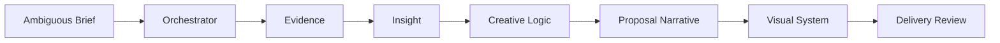

# Workflow

[简体中文](workflow.md)

The system separates advertising proposal work into seven sequential but independently callable modules.

## 1. Frame the assignment

Define the proposal type, decision-maker, objective, known inputs, missing information, assumptions, specialist skill sequence, and required deliverables.

## 2. Build the evidence base

Research category, consumer, competition, channel, culture, and brand context. Record the original source, date, finding, confidence level, limitation, and intended use for every material claim.

## 3. Generate and challenge insight

Turn facts into strategic interpretations. Score each candidate on reinterpretation, point of view, action impact, evidence, and counterargument; recommend the strongest three.

## 4. Translate strategy into creative logic

Choose only the strategic lenses relevant to the assignment. Use them to explain how the strategy becomes understandable, memorable, repeatable, and actionable — not simply to multiply ideas.

## 5. Build the client narrative

Construct a persuasion chain from context and problem to insight, strategy, creative direction, execution, and value. Give every slide one primary argument, its evidence, and its transition.

## 6. Define the visual system

Translate subjective language into concrete rules for composition, image type, information density, hierarchy, typography, color, and page behavior. Produce a design handoff, not a mood-only description.

## 7. Review and compound learning

Before delivery, inspect logic, evidence, page clarity, stakeholder fit, and objection risk. After delivery, separate project-specific observations from methods and assets worth reusing.
