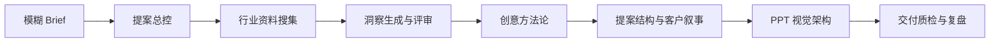

# Workflow

[English](workflow.en.md)

这套 Skills 把广告提案拆成 7 个连续但可独立调用的专业模块。每一环都有明确输入、判断标准和交付物，避免在信息不足时直接进入 PPT 或创意发散。

## 1. 提案总控

先拆题，不急着写 PPT。

输出：

- 项目判断
- 已知信息
- 缺失信息
- 后续 Skill 调用顺序
- 交付物清单

## 2. 行业资料搜集

把资料变成可追溯的决策证据库。

输出：

- 来源
- 年份
- 数据点
- 原文摘要
- 可用结论
- 可信度
- 局限
- 适合放在哪一页

## 3. 洞察生成与评审

把事实变成策略判断。

评分维度：

- 是否重新解释事实
- 是否有明确立场
- 是否影响产品/传播/渠道动作
- 是否有证据和反证

## 4. 创意方法论

创意方法论不是点子生成器，而是策略转译器。

内置思考方式：

- 华与华：超级符号、超级话语、购买理由、货架动作。
- 奥美/Deck of Brilliance：52 张策略解释卡。
- 麦肯锡：结论先行、SCQA、MECE、证据链。
- 群玉山：公共角色、时代情绪、小人物叙事。

## 5. 提案结构与客户叙事

把策略和创意组织成客户听得懂的说服链。

输出：

- 提案主线
- 章节结构
- 逐页蓝图
- 客户版摘要
- 讲稿要点

## 6. PPT 视觉架构

把“高级、大气、年轻化”翻译成可执行视觉规则。

输出：

- 行业视觉公约
- 风格关键词
- 页面规则
- 逐页视觉蓝图
- 设计交接清单

## 7. 交付质检与复盘

交付前检查风险，交付后沉淀资产。

输出：

- 修改清单
- 风险提示
- 复盘沉淀
- 可沉淀为 Skill 的资产列表
